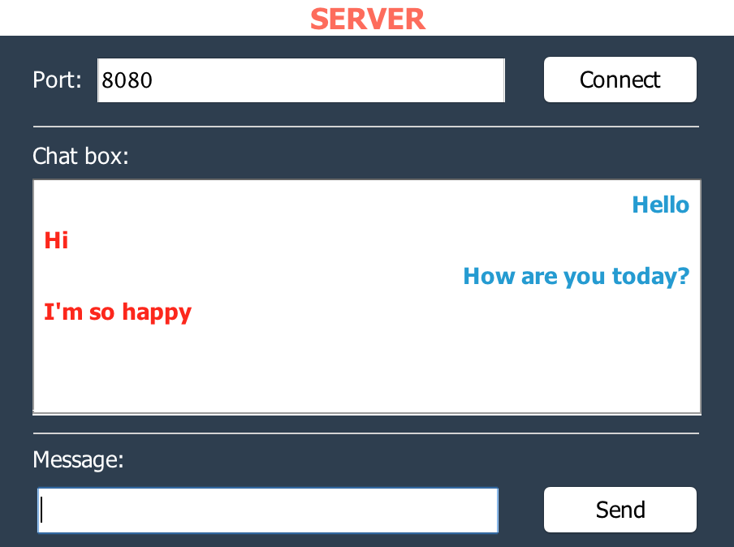
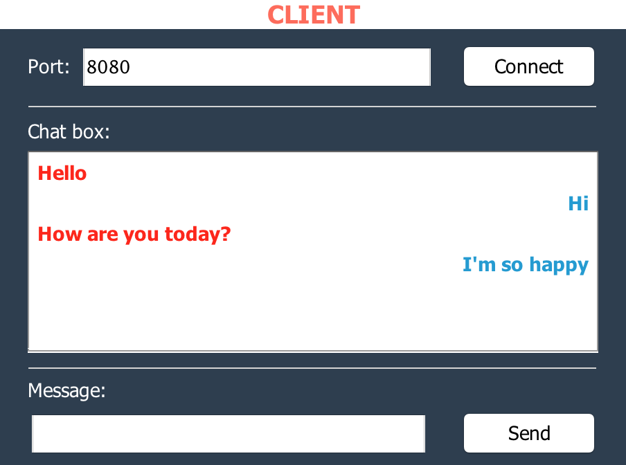

# Make a simple chat between client and server.
This app was made of swing in java

*** 

Server screenshot:

Client screenshot:

### Usage:
1. Open demo folder

2. Open terminal and type: `java Server` to open server app

3. And then type: `java Client` to open client app

4. Enter the port at server app first and click connect
(Using the port between 1024 – 49151 to avoid conflict with orther app or system port)

5. Enter the port at client app and click connect
(The port have to match with the port entered in server app)

6. Finally, try it now.